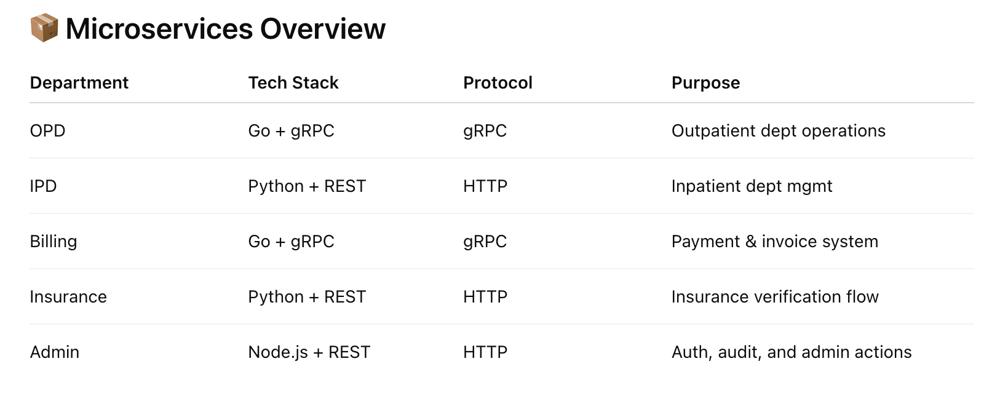

[](https://github.com/somnathbm/hospital-hms/actions/workflows/ci-opd.yaml)
[](https://github.com/somnathbm/hospital-hms/actions/workflows/ci-billing.yaml)
[](https://github.com/somnathbm/hospital-hms/actions/workflows/ci-appointment.yaml)

# 🏥 hospital-hms

---

A **production-like, cloud-native Hospital Management System (HMS)** that simulates the digital operations of a modern hospital. Built using microservices architecture, GitOps with ArgoCD, Kubernetes (EKS), and backed by complete CI/CD, observability, and gRPC-based service communication.

> Designed to showcase real-world **DevOps**, **SRE**, and **Platform Engineering** skills.

---

## 🚀 Features

- 🔧 **Multi-service architecture**: Each hospital department (OPD, IPD, Billing, Insurance, etc.) is implemented as an independent microservice.
- ⚙️ **CI/CD Pipelines**: GitHub Actions for lint → test → build → Helm/K8s manifest update.
- 📦 **Progressive Delivery**: ArgoCD + Argo Rollouts for automated canary deployments.
- 🛠️ **GitOps Workflow**: Declarative infrastructure and applications managed via Git.
- 🐳 **Kubernetes on AWS (EKS)**: Infrastructure-as-Code provisioning with Terraform/SAM/Cloudformation.
- 🧪 **Observability & Monitoring**: Prometheus, Grafana dashboards, OpenTelemetry traces.
- 🔐 **Security & Policy-as-Code**: Checkov-based compliance, IAM best practices, and secrets management.
- 🔁 **gRPC Communication**: High-performance service-to-service interaction using Protobuf and gRPC.
- 🧭 **Internal Developer Platform**: Port-based IDP for service discovery and self-service onboarding.

---

## 📁 Services Monorepo Structure

```bash
hospital-hms/
  .
  ├── .github
  │   └── workflows             # GitHub Actions for CI/CD
  ├── docs                      # Architecture diagrams, images, documents
  ├── microservices             # Microservices
  │   ├── appointment-service
  │   ├── billing-service
  │   ├── ipd-service
  │   ├── laboratory-service
  │   └── opd-service
  └── shared                    # Shared Protobuf contracts
      └── proto            
```

---

## 🧭 Infrastructure Repo
[hospital-hms-infra](https://github.com/somnathbm/hospital-hms-infra.git)

---



---

## ⛩️ Cluster Architecture Diagram


---

## 🔄 CI/CD Strategy

  - **CI**: GitHub Actions
    - Code linting
    - Unit testing
    - Docker build & push
    - Helm/K8s manifest update

  - **CD**: GitOps with ArgoCD
    - ArgoCD monitors repo for manifest changes
    - Canary/Blue-Green deployments via Argo Rollouts

---

## ⛩️ CI Workflow diagram


---

## ⛩️ CD Workflow diagram


---

## 📊 Observability Stack

  - **Prometheus + Grafana**: Real-time metrics
  - **New Relic / Dynatrace**: Application performance monitoring (APM)
  - **OpenTelemetry**: Tracing gRPC and REST interactions

---

## 🧪 Future Enhancements (Roadmap)

  - ✅ Service Mesh integration (Istio/Linkerd)
  - ✅ Centralized logging (ELK / Loki)
  - ⏳ Chaos Engineering (Litmus)
  - ⏳ Horizontal Pod Autoscaling + VPA
  - ⏳ Multi-region failover simulation

---

## 🤝 Contributing

This is a solo showcase project intended to simulate real-world complexity for demonstration, learning, and career transitions into DevOps/SRE/Platform Engineering.

---

## 📄 License

MIT

---

## 🙋‍♂️ About the Author (me)

👋 Hi, I’m Somnath Mukherjee, a former SDE II with 8+ years of experience, now transitioning into Platform Engineering & SRE roles. This project represents my hands-on understanding of modern DevOps tooling, cloud-native architecture, and infrastructure automation.

You can connect with me on [LinkedIn](https://www.linkedin.com/in/somnathbm/) or check out more on my [GitHub](https://github.com/somnathbm).